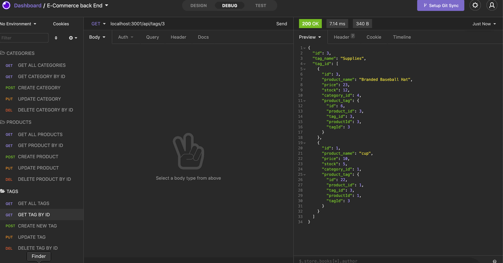
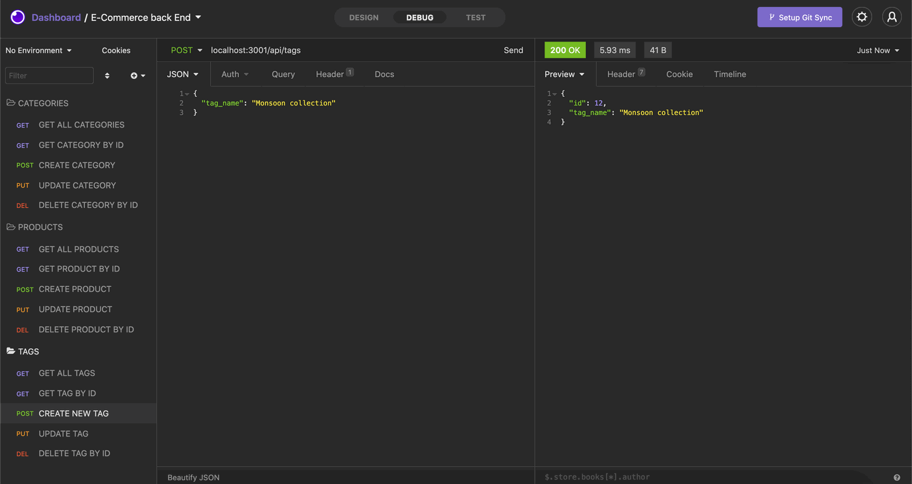
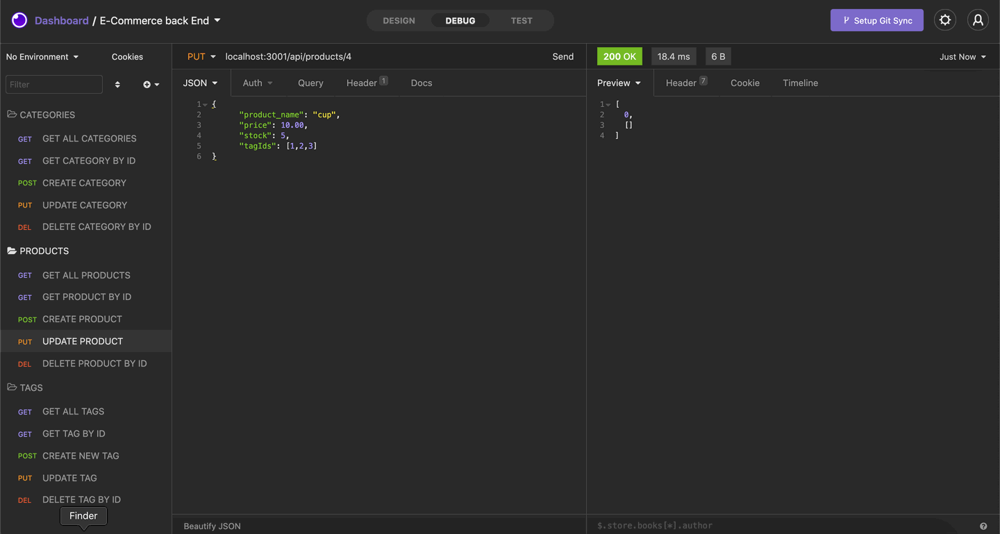
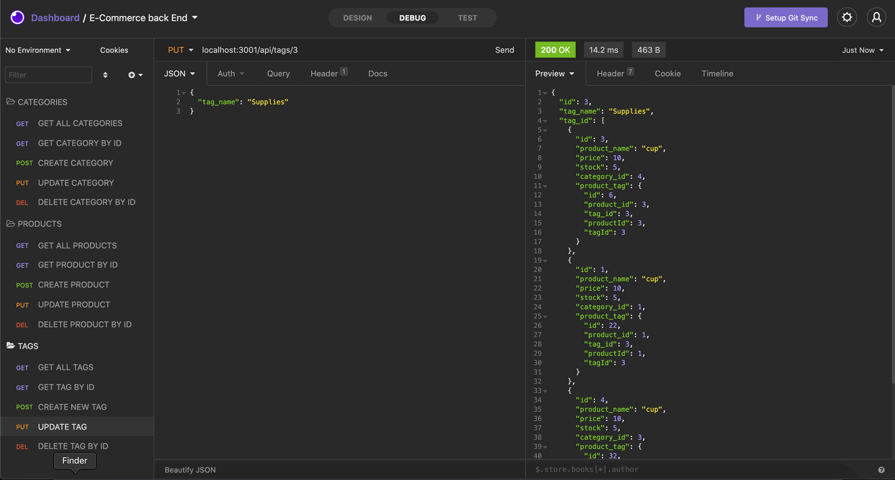
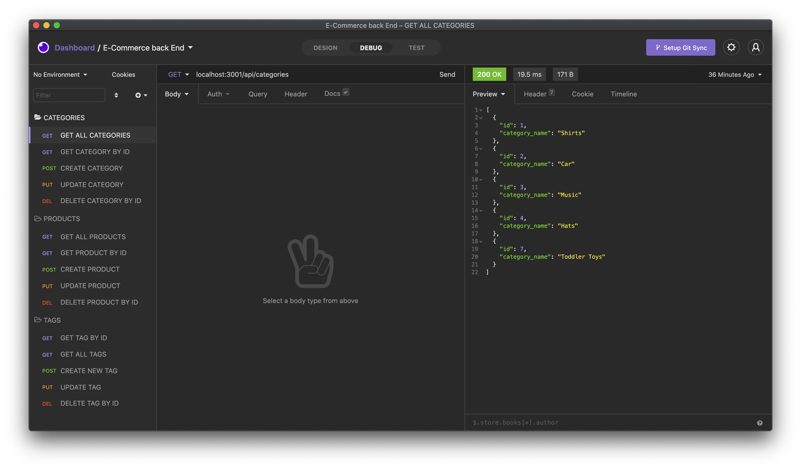

# E-Commerce-Back-End

 [E-Commerce-Back-End](#ECommerce-Back-End)
    - [Table of Contents](#table-of-contents)
  * [Summary](#summary)
  * [Description](#description)
  * [Pre-requisite](#pre-requisite)
  * [demo](#demo)
  * [Technologyused:](#technologyused-)
  * [Install:](#install-)
  * [Contributor](#contributor)
  * [codebase](#codebase)
  * [Application Walk-through](#Application-walk-through)

## Summary
Internet retail, also known as **e-commerce**, is the largest sector of the electronics industry, generating an estimated $29 trillion in 2019. E-commerce platforms like Shopify and WooCommerce provide a suite of services to businesses of all sizes. Task is to build the back end for an e-commerce site. Configure a working Express.js API to use Sequelize to interact with a MySQL database.

## Description
Application have 3 tables - 
1. Product: 
        ID (Primary key),
        product_name (String),
        price (decimal),
        Stock (Integer),
        category_id(References the 'Category' model's 'id')

2. Category
        id (Primary key)
        Category_name

    
3. Tag
        id (Primary key),
        tag_name (String)

  
4. ProductTag
        id (Primary key),
        product_id (Integer) References the 'Product' model's 'id',
        tag_id (Integer)  References the 'Tag' model's 'id'.

Create a back-end for E-commerce application to demonstrate routes in Insomnia. 
1.  GET routes to return all Categories, all Products, and all Tags 
2.  GET By ID to return Product by ID, Category by ID & Tag by ID 
3.  POST routes to create new Cateogry, Product and Tag
4.  PUT routes to update Category, Product, Tag for given ID.
5.  DELETE routes to delete Category, Product, Tag for given ID.

## Pre-requisite
Install NodeJS 

## demo

## Technologyused:
<ul>
    <li> 
    <a href="https://sequelize.org/" target="_blank">Sequilize  <a>
     
    </li>
    <li> 
    <a href="https://nodejs.org/en/docs/" target="_blank">NodeJS <a>
    <li> 
    <a href="https://expressjs.com/en/guide/routing.html" target="_blank">Express.js<a>
    </li>
    <li> 
    <a href="https://dev.mysql.com/doc/" target="_blank">mySQL </a>
</ul>

## Install:
<strong>Code installation:</strong>  
$ cd [path_to_save_codebase]  
$ git clone https://github.com/arti-karnik/E-Commerce-Back-End 

<strong> Run the application: </strong>  
Open Terminal  
$ npm install  
$ node server.js  
Open Insomnia to test routes 

## Contributor
<strong> Github Profile: </strong>  
https://github.com/arti-karnik

<strong> Portfolio: </strong>  
https://arti-karnik.github.io/MyPortfolioPage/

## codebase
https://github.com/arti-karnik/E-Commerce-Back-End

## Application Walk-through
https://drive.google.com/file/d/1RJ6uXCoyeleA9IOTV5wnyu5gaLeHdt9K/view?usp=sharing

